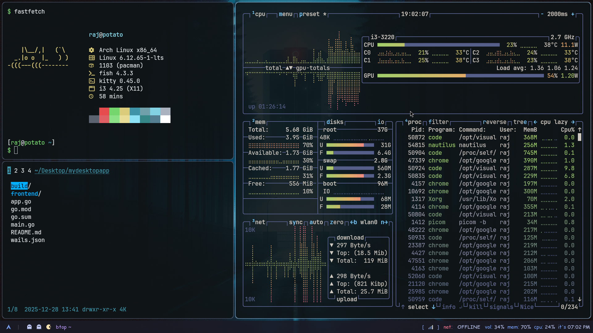
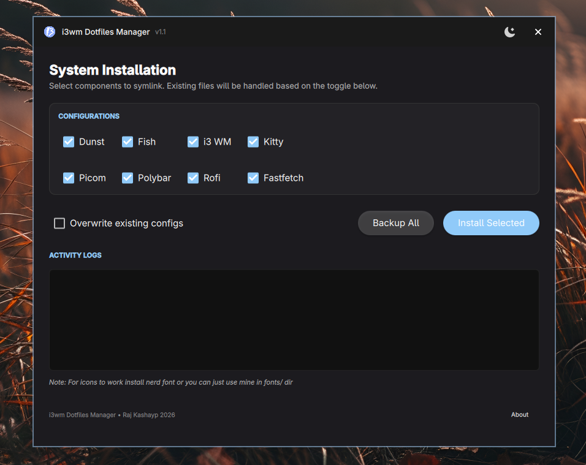

# i3wm Dotfiles with GUI installer

My Arch Rice with i3wm and polybar

## Preview



> GUI installer



## Features

- **Dotfiles Management**: Install, backup, and restore various dotfile configurations

## Requirements

- i3
- polybar
- waypaper
- feh
- nm-applet or network-manager-applet
- playerctl
- pavucontrol
- spectacle (already installed in kde desktop)
- picom (optional, used for blur effect)
- [rofi-emoji-git](https://github.com/Mange/rofi-emoji) (for emoji picker) 
- playerctl
- python-dbus
- python-i3ipc
- [autotiling](https://github.com/nwg-piotr/autotiling) (optional)

`Below Only if you need GUI dotfiles installer`

- Qt 6.2 or higher
- Qt Quick Controls 2
- Qt Quick Controls Material Style
- Standard C++ build tools

## Usage

1. Give persmission to execute on script for i3 and polybar in

```bash
chmod +x polybar/scripts/*.sh
chmod +x i3/scripts/*.{sh,py}
```

2. Install the fonts from `fonts` directory.

3. Download the binary from [releases](https://github.com/Raj-Kashyap001/repo/releases) section.

4. Run the application:

   ```bash
   ./Dotinst
   ```

5. Select dotfile components to install and click "Install Selected"

## Building Installer from source

1. Install dependencies:

   ```bash
   sudo apt-get install qt6-base-dev qt6-declarative-dev libqt6quickcontrols2-6 libqt6quickcontrols2-6-dev
   ```

2. Build the application:

   ```bash
   cd dotinst
   qmake
   make

   # or

   chmod +x build_installer.sh
   ./build_installer.sh
   ```

## Troubleshooting

If the application crashes:

- Copy paste configs to there corresponding config locations that's it....
  (ignore below probably)
- Ensure all required Qt libraries are installed
- Verify that the theme icons exist in the correct location
- Check that all resource files are properly included in the Qt resource system

## License

This project is licensed under the MIT License.
